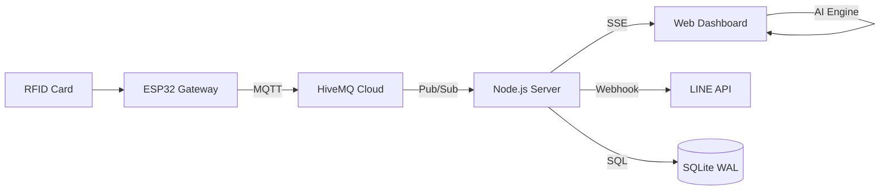

# 🏫 SmartGate Pro (Mega Edition)

> ระบบบริหารจัดการการเข้า-ออกโรงเรียนอัจฉริยะแบบเบ็ดเสร็จ  
> **RFID + AI Face Recognition + Edge Computing + LINE Notification**

[](https://nodejs.org)
[](docs/esp32_firmware/)
[](https://github.com/justadudewhohacks/face-api.js)

---

## ✨ Key Features (Mega Updates)

| Feature | Technical Highlight | Status |
|---|---|---|
| 🤖 **AI Flash-By Optimization** | กรองภาพเบลอ (Quality Filter) + Consistency Check (8 Frames/0.8s) | ✅ |
| 🪪 **Type-Aware Debounce** | กันสแกนเบิ้ล แต่สลับโหมด In/Out ได้ทันที (Zero Delay context switch) | ✅ |
| 👨‍👩‍👧 **Parent Management** | เพิ่มฐานข้อมูลชื่อ-เบอร์โทรผู้ปกครองแยกรายบุคคล | ✅ |
| 📸 **Pro Management UI** | ถ่ายรูปผ่านเว็บแคมสดๆ หรืออัปโหลดไฟล์รูปเพื่อทำ AI Training | ✅ |
| 🔄 **Intelligent Profile Sync** | เลือกรูปภาพจากการสแกน "ผ่าน" ย้อนหลังมาเป็นรูปโปรไฟล์ได้ทันที | ✅ |
| 🚀 **High-Performance AI** | Descriptor Caching (IndexedDB) + Model Pre-warming | ✅ |
| 📊 **Mega Reporting** | ระบบสร้างรายงานโครงงานอัตโนมัติ 10 บท (Professional DOCX) | ✅ |

---

## 🏗️ Architecture & Protocol



- **MQTT Topics:**
  - `smartgate/checkin`: ส่ง UID บัตร และคำสั่ง Check-in
  - `smartgate/feedback`: รับคำสั่งคุม LED/Buzzer (`accepted`, `late`, `checkout`, `error`)
- **SSE Bridge:** ส่งสัญญาณ Trigger หน้าจอมอนิเตอร์และกล้องแบบ Low-latency

---

## 🛠️ Tech Stack & Requirements

### Software
- **Core:** Node.js 18+ & Express.js
- **UI:** Tailwind CSS & Vanilla JS (Glassmorphism design)
- **AI:** face-api.js (TinyFaceDetector, 68 Landmark, Recognition)
- **DB:** SQLite 3 (Write-Ahead Logging mode)
- **Networking:** MQTT 5.0 (PubSubClient), ngrok (Tunneling)

### Hardware Pinout (ESP32)
| Component | Pin | Function |
|---|---|---|
| **RFID Reader (UART)** | RX2 (GPIO 16) | รับข้อมูลบัตร (9600 Baud) |
| **LED Green** | GPIO 25 | ยืนยันผ่าน / เช็คเอาท์ |
| **LED Yellow** | GPIO 26 | แจ้งเตือน "มาสาย" |
| **LED Red** | GPIO 32 | ปฏิเสธการสแกน / ไม่พบข้อมูล |
| **Buzzer** | GPIO 13 | สัญญาณเสียง Multi-tone |

---

## 🚀 Installation & Setup

1. **Clone & Install:**
   ```bash
   git clone https://github.com/xhier2547/SmartGate-Pro-with-rfid.git
   cd SmartGate-Pro-with-rfid
   npm install
   ```

2. **Secrets Configuration:**
   สร้างไฟล์ `.env` :
   ```env
   LINE_TOKEN=your_token
   DEFAULT_LATE_TIME=08:00
   PORT=3000
   ```

3. **Data Initialization:**
   ```bash
   mkdir -p database data public/photos
   ```

4. **Launch:**
   ```bash
   npm run dev  # หรือ node server.js
   ```

---

## 📡 AI Tuning (Advanced)
เพื่อให้ระบบรองรับการเดินผ่านที่รวดเร็ว (Flash-by):
- **Confidence Threshold:** `0.58` (ปรับสมดุลระหว่าง False Positive และความไว)
- **Sample Rate:** 100ms per frame
- **Consistency Goal:** 2 matching frames within 8 samples

---

## 📁 Project Structure

```text
├── server.js              # Central Engine & MQTT Logic
├── js/
│   ├── face_ai.js         # Optimized AI Face Engine (Peak Detection)
│   ├── dashboard.js       # Admin Stats & Analytics
│   └── main.js            # Home Logic
├── views/
│   ├── manage.html        # Smart Student & Parent Management
│   ├── index.html         # Main Check-in Dashboard
│   └── monitor.html       # Public Display Monitor
├── docs/
│   └── esp32_firmware/    # C++ Arduino Code
└── public/photos/         # Student AI Training Data
```

---

## 👤 Developer
**นายอภิลักษณ์ จันทร์แก้วเดช**  
รหัสนักศึกษา: 6610110688  
ปีการศึกษา 2567  

---

## 📝 License
MIT License - Open for educational use.
